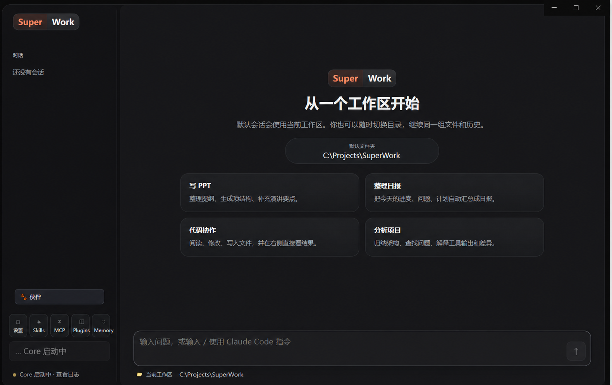

# SuperWork

[English](./README_EN.md) | 中文



SuperWork 是基于 `claude-code-best/claude-code` 的桌面能力扩展项目。项目目的，是在保留上游 TUI、配置兼容性和核心 `query()`/loop 逻辑的前提下，通过 Electron + Bun Core Sidecar 为原项目增加独立 Desktop 桌面端能力。

> **上游项目声明：** SuperWork 基于 [claude-code-best/claude-code](https://github.com/claude-code-best/claude-code) 二次开发，主要修改目的是为原项目增加 Desktop 桌面能力。上游 README 声明项目仅供学习研究使用，且当前未提供可读取的根目录 `LICENSE` 文件。因此，本仓库不对上游代码授予复制、再分发或商业使用许可。原项目及其贡献者的权利不因本项目改名或二次开发而改变。

## 主要能力

- 流式问答、思考块与 Markdown/代码块渲染
- 读取、编辑、写入、Shell、搜索等工具调用折叠展示
- 工具权限审批、生成中断与错误日志
- 按工作区归类的会话历史
- 文件预览、编辑 Diff、HTML、Mermaid 与本地 PlantUML 渲染
- 模型、模式、Skills、MCP、Plugins 与记忆配置入口
- 保留原有 TUI；桌面模块不改写核心 `query()` 循环

## 快速开始

需要 Bun 1.3 或更高版本。

```bash
bun install
bun run desktop:dev
```

常用命令：

```bash
bun run desktop:test
bun run desktop:build
bun run --cwd packages/desktop package:win
bun run typecheck
```

Windows 安装包默认输出到 `packages/desktop/release/`，该目录属于本地构建产物，不提交到仓库。

## 系统架构

### 进程模型

SuperWork 桌面端采用 **Electron + Bun Core Sidecar** 双进程架构，渲染层、主进程、Core 各自承担清晰职责：

- **Electron 主进程**（Node.js 运行时）：窗口/菜单/IPC/本地资源访问，监督 Sidecar 生命周期
- **Bun Core Sidecar**（Bun 运行时）：承载 Claude Code 核心 `query()` 循环、工具执行与会话状态
- **渲染进程**（Chromium）：React 19 + Vite，仅通过 preload 暴露的 `desktopApi` 与主进程通信

```
┌──────────────────────── Electron Main ────────────────────────┐
│  BrowserWindow + preload  ⇄  SidecarManager  ⇄  Diagnostics   │
│         (desktopApi)         (supervise)         (logs/status) │
└──────────────┬───────────────────┬────────────────────────────┘
               │ IPC (Zod-validated)│ spawn / stdin / stdout / stderr
               ▼                    ▼
┌────────────────────── Renderer ──────────────┐  ┌──────── Core Sidecar (Bun) ────────────┐
│  App.tsx (useReducer)                        │  │  entry.ts (protocol pump)               │
│   └─ reducer.ts (event→state)                │  │   └─ CommandDispatcher (25+ commands)   │
│       └─ features/ (chat/history/settings/…) │  │       └─ ConversationController         │
└──────────────────────────────────────────────┘  │           └─ DesktopQueryRunner         │
                                                  │               └─ src/QueryEngine.ts    │
                                                  │                   └─ src/query.ts       │
                                                  │           EventAdapter (stream→protocol)│
                                                  └─────────────────────────────────────────┘
```

### 分层职责

**Shared Layer** — [`packages/desktop/shared/`](./packages/desktop/shared/)

跨进程协议的单一真相源，所有 `DesktopCommand` / `DesktopEvent` 通过 Zod schema 校验后才进入对方进程。

- [`protocol.ts`](./packages/desktop/shared/protocol.ts)：`DESKTOP_PROTOCOL_VERSION = 1`、诊断状态枚举、类型 re-export
- [`schemas.ts`](./packages/desktop/shared/schemas.ts)：全部 Zod schema（命令、事件、会话、工具、权限、配置、性能、Buddy）
- [`types.ts`](./packages/desktop/shared/types.ts)：从 schema 推导 TypeScript 类型
- [`errors.ts`](./packages/desktop/shared/errors.ts)：`createDesktopError` 工厂，7 种错误码
- [`file-paths.ts`](./packages/desktop/shared/file-paths.ts)：桌面端路径解析

**Electron Main Layer** — [`packages/desktop/electron/`](./packages/desktop/electron/)

窗口生命周期、Sidecar 监督、IPC 路由、本地资源访问。

- [`main.ts`](./packages/desktop/electron/main.ts)：入口，创建 `BrowserWindow`、注册 6 个 IPC handler、启动 `SidecarManager`
- [`sidecar-manager.ts`](./packages/desktop/electron/sidecar-manager.ts)：状态机 `stopped/starting/ready/restarting/failed`，崩溃后单次自动重启，二次失败标记永久失败；握手前命令排队
- [`node-sidecar-process.ts`](./packages/desktop/electron/node-sidecar-process.ts)：`child_process.spawn('bun', ['run', entry])`，`stdio: pipe`、`windowsHide: true`
- [`resolve-sidecar.ts`](./packages/desktop/electron/resolve-sidecar.ts)：解析 Bun 可执行路径与 entry（packaged 走 `resources/runtime/bun.exe` + `resources/core/main.js`；dev 走 `dist/`；可被 `CCB_BUN_PATH` 覆盖）
- [`desktop-api.ts`](./packages/desktop/electron/desktop-api.ts)：`createDesktopApi` 返回 `Object.freeze` 的 API 表面，**不暴露通用 IPC 原语**
- [`preload.ts`](./packages/desktop/electron/preload.ts)：`contextBridge.exposeInMainWorld('desktopApi', ...)`，渲染层调用的唯一入口
- [`diagnostics-service.ts`](./packages/desktop/electron/diagnostics-service.ts)：收集 Core 状态 + Sidecar stderr（按 `[LEVEL]` 前缀路由）+ 自身日志
- [`desktop-logger.ts`](./packages/desktop/electron/desktop-logger.ts) / [`workspace-editor-service.ts`](./packages/desktop/electron/workspace-editor-service.ts) / [`app-menu.ts`](./packages/desktop/electron/app-menu.ts) / [`window-options.ts`](./packages/desktop/electron/window-options.ts) / [`channels.ts`](./packages/desktop/electron/channels.ts)：文件日志、系统编辑器检测、菜单模板、窗口选项、IPC 通道常量

**Core Sidecar Layer** — [`packages/desktop/core/`](./packages/desktop/core/)（Bun 运行时）

零改写复用上游 [`src/query.ts`](./src/query.ts) 与 [`src/QueryEngine.ts`](./src/QueryEngine.ts)，仅在外围做协议适配。

- [`main.ts`](./packages/desktop/core/main.ts)：入口，`logCore` 仅写 stderr（带 `[INFO]`/`[ERROR]` 前缀，stdout 保持纯 NDJSON），动态 import 上游 `init`/`config`/`model`/`session`/`storage` 模块，组装各 service
- [`entry.ts`](./packages/desktop/core/entry.ts)：`runCoreProtocol` 协议泵 — 启动即 emit `core.ready`，`JsonLineDecoder` 解析 stdin，`DesktopCommandSchema` 校验，失败 emit `command.failed (INVALID_COMMAND)`
- [`command-dispatcher.ts`](./packages/desktop/core/command-dispatcher.ts)：路由 25+ 命令到各 service（`session.*` / `prompt.submit` / `generation.interrupt` / `permission.resolve` / `model.set` / `mode.set` / `config.*` / `file.*` / `memory.*` / `buddy.*` / `performance.get` / `core.shutdown`）
- [`conversation-controller.ts`](./packages/desktop/core/conversation-controller.ts)：拥有 `sessions` Map，**单一生成并发约束**（`activeGeneration`），首事件 45s 超时，interrupt/failed/completed 三态 finalize
- [`desktop-query-runner.ts`](./packages/desktop/core/desktop-query-runner.ts)：每 session 一个 `QueryEngine` 实例，`createDesktopCanUseTool` 把核心权限管道桥接到 `PermissionBroker`，本地处理 `/help` 等 slash 命令
- [`event-adapter.ts`](./packages/desktop/core/event-adapter.ts)：把 `query()` 的不稳定事件流（`stream_request_start` / `result` / `stream_event.assistant` / `user`）转为稳定桌面协议事件，累计 token usage
- [`permission-broker.ts`](./packages/desktop/core/permission-broker.ts)：桥接核心 awaited 权限检查 → 序列化 UI 事件，5min 超时默认 deny
- [`desktop-config-service.ts`](./packages/desktop/core/desktop-config-service.ts) / [`session-service.ts`](./packages/desktop/core/session-service.ts) / [`buddy-service.ts`](./packages/desktop/core/buddy-service.ts) / [`performance-service.ts`](./packages/desktop/core/performance-service.ts) / [`model-connection-test.ts`](./packages/desktop/core/model-connection-test.ts) / [`turn-usage.ts`](./packages/desktop/core/turn-usage.ts)：配置读写、会话列表/恢复/删除、桌面吉祥物、性能统计（7d/30d/all）、模型连通性测试、Token 用量与成本

**Renderer Layer** — [`packages/desktop/renderer/src/`](./packages/desktop/renderer/src/)（React 19 + Vite）

仅消费 `desktopApi`，无直接 fs/network/ipc 访问。

- [`main.tsx`](./packages/desktop/renderer/src/main.tsx)：渲染层入口
- [`app/App.tsx`](./packages/desktop/renderer/src/app/App.tsx)：主组件，`useReducer` + `desktopApi.subscribe`，三视图（`chat` / `settings` / `performance`）
- [`app/reducer.ts`](./packages/desktop/renderer/src/app/reducer.ts)：reducer 处理 `DesktopEvent` + 本地 action，session 内 messages/tools/permissions 全部 Map 化
- [`app/ResizableWorkspace.tsx`](./packages/desktop/renderer/src/app/ResizableWorkspace.tsx)：可调大小布局
- `features/` 功能模块：
  - `chat/` — `ConversationPane`、`Composer`、`MessageRow`、`MarkdownMessage`、`DiagramRenderer`、`ToolCallCard`、`TurnUsageReport`、`slashCommands`、`toolRendering`、`plantumlLocalRenderer`
  - `history/` — `SessionSidebar`（按工作区分组）
  - `settings/` — `ConfigCenter`、`SessionSettings`（模型/模式/Skills/MCP/Plugins/记忆）
  - `files/` — `ConversationFilesPanel`（文件预览/Diff）
  - `permissions/` — 工具权限审批 UI
  - `diagnostics/` — `DiagnosticsDrawer`（Core 状态 + 日志）
  - `buddy/` — `BuddyPanel`
  - `performance/` — `PerformanceCenter`（趋势图/模型分布/工具统计）
  - `i18n/` — 国际化

### 跨进程协议

**启动握手**

1. Electron `whenReady` → `createWindow` → `resolveSidecar` → `spawn('bun', ['run', entry])`
2. Bun sidecar 启动 → 立即 emit `core.ready { protocolVersion: 1 }` → `SidecarManager` 状态切 `ready`，flush 握手前排队的命令
3. 渲染层 `desktopApi.subscribe` 收到 `core.ready`，标记 `coreReady = true`

**stdin / stdout / stderr 契约**（硬约束）

| 通道 | 方向 | 载荷 | 备注 |
|------|------|------|------|
| stdin | Electron → Bun | NDJSON `DesktopCommand` | 每行一条，Zod 校验 |
| stdout | Bun → Electron | NDJSON `DesktopEvent` | **仅协议消息，禁止日志** |
| stderr | Bun → Electron | `[LEVEL] [desktop-core] message` | `DiagnosticsService` 按前缀路由级别 |

**命令分发**（Renderer → Core）

```
window.desktopApi.submitPrompt(sessionId, text)
  → ipcRenderer.send(DESKTOP_COMMAND_CHANNEL, command)
  → ipcMain.on → sidecar.send(encodeJsonLine(command))
  → Bun stdin → JsonLineDecoder → DesktopCommandSchema.safeParse
  → dispatcher.dispatch → service 执行
```

**事件回传**（Core → Renderer）

```
Core emit(event) → process.stdout.write(encodeJsonLine(event))
  → Electron onOutput → DesktopEventSchema.parse
  → webContents.send(DESKTOP_EVENT_CHANNEL, event)
  → 渲染层 ipcRenderer.on → reducer
```

**权限流**（核心桥接）

```
QueryEngine 遇到需要 ask 的工具
  → createDesktopCanUseTool → PermissionBroker.request
  → emit permission.requested
  → 渲染层 permissions UI → 用户点击
  → desktopApi.resolvePermission(id, decision)
  → IPC → command-dispatcher → permissionBroker.resolve
  → Promise resolve → QueryEngine 继续
```

**错误与恢复**

- 协议不匹配 → `command.failed (INVALID_COMMAND)`
- 命令异常 → `command.failed (QUERY_FAILED, recoverable=true)`
- Sidecar 崩溃 → 首次自动重启；二次失败 `onPermanentFailure` → emit `SIDECAR_CRASHED (recoverable=false)`
- 首事件 45s 超时 → `AbortController.abort` → `complete('failed')`
- 权限请求 5min 超时 → 默认 `deny`

### 安全模型

- **最小化渲染层能力**：preload 通过 `contextBridge` 仅暴露 `desktopApi`，不暴露 `ipcRenderer`；`DesktopCommand` 走 Zod 校验后才转发到 Sidecar
- **导航限制**：`will-navigate` 阻止；新窗口仅允许 `https://` 走外部浏览器
- **协议版本协商**：`core.ready` 携带 `protocolVersion`，未来可拒绝不兼容版本
- **单一活跃生成**：`DesktopConversationController` 强制每 session 同一时间最多一个 `activeGeneration`

### 与上游核心的关系

桌面端**不 fork、不重写** [`src/query.ts`](./src/query.ts) / [`src/QueryEngine.ts`](./src/QueryEngine.ts) / [`src/tools.ts`](./src/tools.ts) / [`src/Tool.ts`](./src/Tool.ts)，通过动态 import 复用：

- Core Sidecar 启动时调用 `src/entrypoints/init.ts` 完成原有初始化
- `DesktopQueryRunner.getOrCreateEngine` 直接 `new QueryEngine({...})`，传入桌面端的 `canUseTool` 桥接
- 工具列表仍由 `src/tools.ts` 的 `getTools(permissionContext)` 提供，59 个内置工具全部可用
- 权限管道在上游 `hasPermissionsToUseTool` 之上叠加 `PermissionBroker` 桥接 UI

原 TUI 入口 [`src/screens/REPL.tsx`](./src/screens/REPL.tsx) 与桌面端共享同一套核心逻辑，互不干扰。

## 项目结构

- `packages/desktop/electron/`：Electron 主进程与安全 preload
- `packages/desktop/core/`：Bun Sidecar 与桌面事件适配
- `packages/desktop/renderer/`：React 桌面界面
- `packages/desktop/shared/`：桌面协议与共享类型
- `src/query.ts`：原有核心查询循环
- `src/screens/REPL.tsx`：原有 TUI 入口

## 配置与数据

SuperWork 可读取和写入 Claude Code 兼容配置。请勿提交 API Token、用户会话、日志或工作区私有数据。本仓库已忽略 `.env`、`.claudecode/`、`.claude/`、`*.jsonl`、日志、缓存、桌面运行数据和构建目录。

## 合法合规声明

SuperWork 是基于 `claude-code-best/claude-code` 二次开发的独立学习研究项目，不隶属于 Anthropic，也不是官方 Claude Code 产品。Claude Code 相关权利归 Anthropic 及相应权利人所有。项目只应连接使用者有权访问的模型与服务，不得用于绕过认证、付费、权限或安全限制。原始 `CLAUDE.md`、`AGENTS.md`、上游署名和第三方声明应保持完整。

本仓库标记为 `UNLICENSED`，不构成对上游代码或第三方组件的许可授权。公开复制、分发、商业使用或再许可前，应自行取得相关权利人的明确授权。

完整中英文边界见 [项目生命协议](./PROJECT_PROTOCOL.md) 与 [上游声明](./UPSTREAM_NOTICE.md)。使用本项目时，还应遵守适用法律、上游声明、第三方许可证以及模型服务条款。

## 贡献

提交代码前请运行：

```bash
bun run typecheck
bun test packages/desktop/tests
```

提交信息使用 Conventional Commits，例如：`feat: 添加桌面文件预览`。
