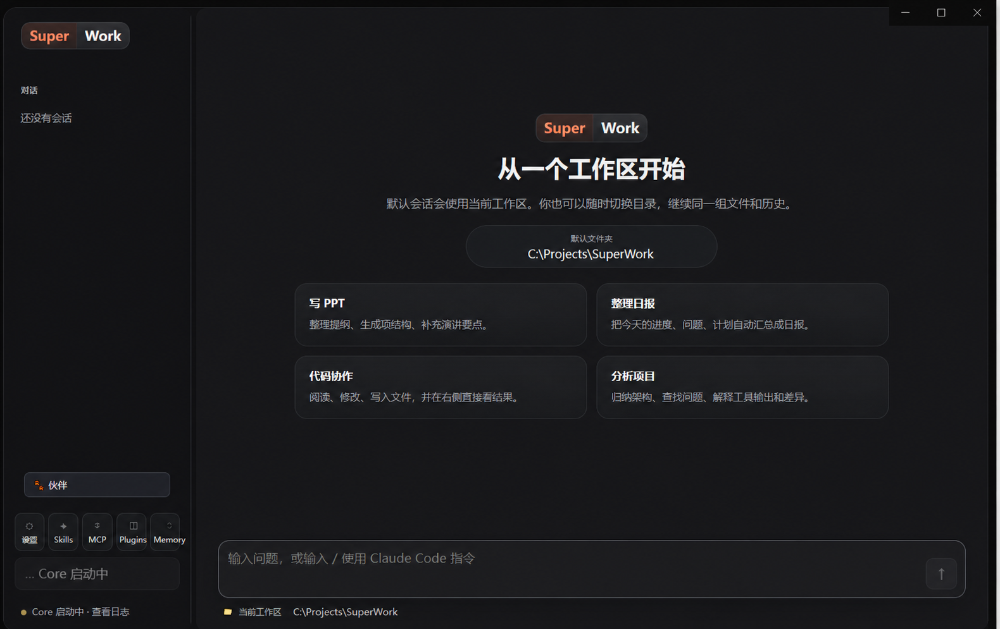
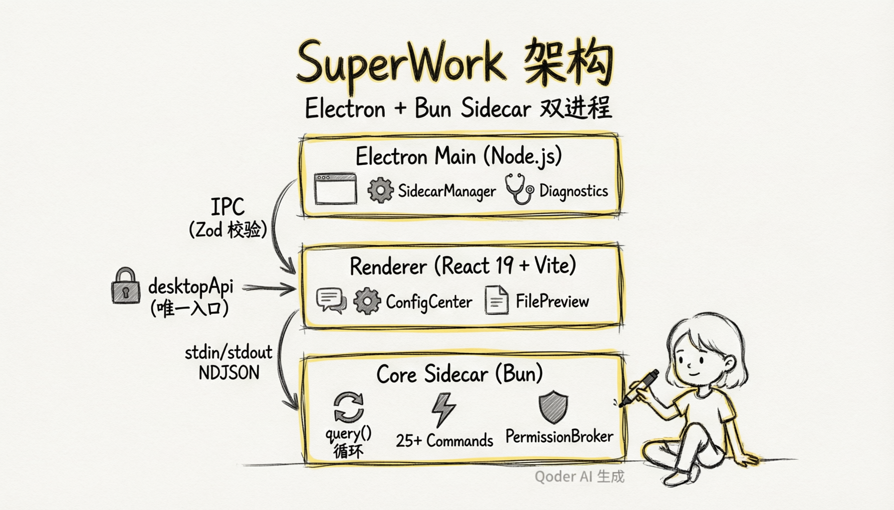
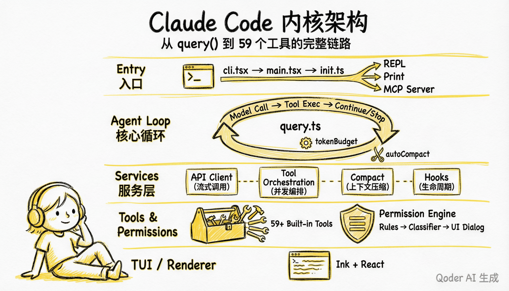
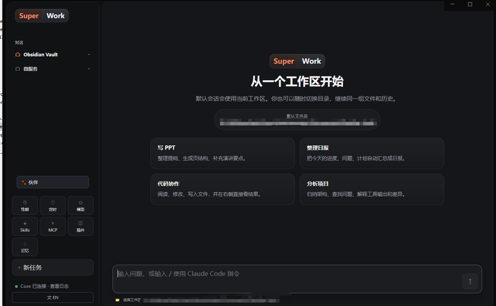
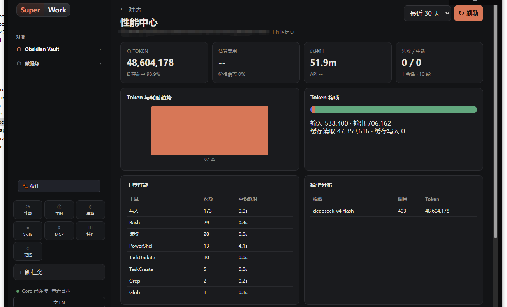
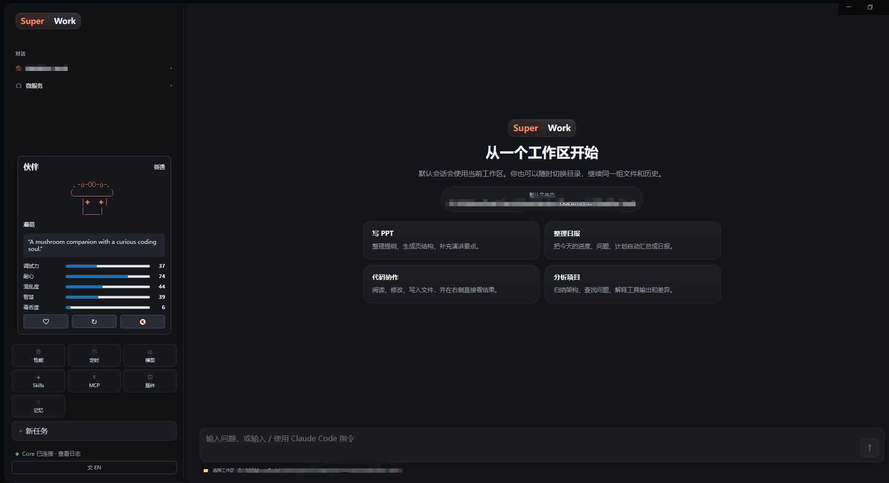

<div align="center">

# SuperWork

**Claude Code 的桌面能力扩展 — Electron + Bun Sidecar 双进程架构**

在保留上游 TUI 与核心 `query()` 循环的前提下，为 Claude Code 增加独立 Desktop 桌面端能力。

[English](./README_EN.md) | 中文

[](https://github.com/SuperCoderMan521/SuperWork/actions/workflows/ci.yml)
[](https://bun.sh)
[](https://www.electronjs.org)
[](https://react.dev)
[](https://www.typescriptlang.org)
[](#合法合规声明)



</div>


## Why SuperWork?

> Claude Code 很强，但它只有终端。SuperWork 给它装上了桌面 GUI。

| 痛点 | SuperWork 的解法 |
|------|------------------|
| 终端里看代码 Diff 像猜谜 | 可视化 Diff + 文件预览，改了什么一目了然 |
| 工具调用刷屏，关键信息淹没 | 59 个工具调用折叠展示，只展开你关心的 |
| 权限确认要盲打 yes/no | GUI 审批面板，看清参数再决定 |
| 会话丢了就没了 | 按工作区自动归档，随时恢复历史对话 |
| 想换模型/挂 MCP 要改配置文件 | 设置面板一键切换，零配置门槛 |
| 上游更新怕 fork 跟不上 | 零侵入架构 — 不 fork 核心，动态 import 复用，上游升级无冲突 |

**一句话：终端能做的它都能做，终端做不好的它做得更好。**

## 目录

- [特性亮点](#特性亮点)
- [快速开始](#快速开始)
- [系统架构](#系统架构)
- [项目结构](#项目结构)
- [配置与数据](#配置与数据)
- [贡献指南](#贡献指南)
- [合法合规声明](#合法合规声明)

## 特性亮点

| 能力 | 说明 |
|------|------|
| 流式对话 | 流式问答、思考块与 Markdown/代码块实时渲染 |
| 工具调用 | 读取、编辑、写入、Shell、搜索等 59 个内置工具折叠展示 |
| 权限管控 | 工具权限审批、生成中断与错误日志 |
| 会话管理 | 按工作区归类的会话历史，支持恢复与删除 |
| 文件预览 | 编辑 Diff、HTML、Mermaid 与本地 PlantUML 渲染 |
| 配置中心 | 模型、模式、Skills、MCP、Plugins 与记忆配置入口 |
| 零侵入核心 | 保留原有 TUI；桌面模块不改写核心 `query()` 循环 |

## 快速开始

**环境要求：** [Bun](https://bun.sh) >= 1.3

```bash
# 安装依赖
bun install

# 启动桌面端（开发模式）
bun run desktop:dev
```

<details>
<summary>更多命令</summary>

```bash
bun run desktop:test          # 运行桌面端测试
bun run desktop:build         # 构建桌面端
bun run --cwd packages/desktop package:win   # 打包 Windows 安装包
bun run typecheck             # 类型检查
```

Windows 安装包默认输出到 `packages/desktop/release/`。

</details>

## 系统架构



### 核心引擎内部结构



上游 Claude Code 核心引擎的分层结构（SuperWork 通过动态 import 完整复用）：

| 层级 | 模块 | 职责 |
|------|------|------|
| Entry | `cli.tsx` → `main.tsx` → `init.ts` | 启动引导、模式路由（REPL / Print / MCP Server） |
| Agent Loop | `query.ts` (AsyncGenerator) | 模型调用 → 工具执行 → Continue/Stop 状态机 |
| Services | `api/` · `tools/` · `compact/` · `hooks/` | 流式 API、并发工具编排、上下文压缩、生命周期钩子 |
| Tools | `packages/builtin-tools/` (59+) | Bash、FileEdit、Grep、Agent、MCP、WebSearch… |
| Permissions | `utils/permissions/` + `hooks/useCanUseTool` | Rules → Classifier → UI Dialog 三层权限 |
| TUI | `screens/REPL.tsx` + `components/` (180+) | Ink + React 终端界面 |

### 进程模型

SuperWork 桌面端采用 **Electron + Bun Core Sidecar** 双进程架构：

```
┌──────────────────────── Electron Main ────────────────────────┐
│  BrowserWindow + preload  ⇄  SidecarManager  ⇄  Diagnostics   │
│         (desktopApi)         (supervise)         (logs/status) │
└──────────────┬───────────────────┬────────────────────────────┘
               │ IPC (Zod-validated)│ spawn / stdin / stdout / stderr
               ▼                    ▼
┌────────────────────── Renderer ──────────────┐  ┌──────── Core Sidecar (Bun) ────────────┐
│  App.tsx (useReducer)                        │  │  entry.ts (protocol pump)               │
│   └─ reducer.ts (event→state)                │  │   └─ CommandDispatcher (25+ commands)   │
│       └─ features/ (chat/history/settings/…) │  │       └─ ConversationController         │
└──────────────────────────────────────────────┘  │           └─ DesktopQueryRunner         │
                                                  │               └─ src/QueryEngine.ts    │
                                                  │                   └─ src/query.ts       │
                                                  │           EventAdapter (stream→protocol)│
                                                  └─────────────────────────────────────────┘
```

- **Electron 主进程**（Node.js）：窗口/菜单/IPC/本地资源访问，监督 Sidecar 生命周期
- **Bun Core Sidecar**（Bun）：承载核心 `query()` 循环、工具执行与会话状态
- **渲染进程**（Chromium）：React 19 + Vite，仅通过 `desktopApi` 与主进程通信

<details>
<summary>跨进程协议详解</summary>

**启动握手**

1. Electron `whenReady` → `createWindow` → `resolveSidecar` → `spawn('bun', ['run', entry])`
2. Bun sidecar 启动 → 立即 emit `core.ready { protocolVersion: 1 }` → `SidecarManager` 状态切 `ready`
3. 渲染层 `desktopApi.subscribe` 收到 `core.ready`，标记 `coreReady = true`

**stdin / stdout / stderr 契约**

| 通道 | 方向 | 载荷 | 备注 |
|------|------|------|------|
| stdin | Electron → Bun | NDJSON `DesktopCommand` | 每行一条，Zod 校验 |
| stdout | Bun → Electron | NDJSON `DesktopEvent` | 仅协议消息，禁止日志 |
| stderr | Bun → Electron | `[LEVEL] [desktop-core] message` | 按前缀路由级别 |

**命令分发**（Renderer → Core）

```
window.desktopApi.submitPrompt(sessionId, text)
  → ipcRenderer.send(DESKTOP_COMMAND_CHANNEL, command)
  → ipcMain.on → sidecar.send(encodeJsonLine(command))
  → Bun stdin → JsonLineDecoder → DesktopCommandSchema.safeParse
  → dispatcher.dispatch → service 执行
```

**事件回传**（Core → Renderer）

```
Core emit(event) → process.stdout.write(encodeJsonLine(event))
  → Electron onOutput → DesktopEventSchema.parse
  → webContents.send(DESKTOP_EVENT_CHANNEL, event)
  → 渲染层 ipcRenderer.on → reducer
```

**权限流**

```
QueryEngine 遇到需要 ask 的工具
  → createDesktopCanUseTool → PermissionBroker.request
  → emit permission.requested
  → 渲染层 permissions UI → 用户点击
  → desktopApi.resolvePermission(id, decision)
  → IPC → command-dispatcher → permissionBroker.resolve
  → Promise resolve → QueryEngine 继续
```

**错误与恢复**

- 协议不匹配 → `command.failed (INVALID_COMMAND)`
- 命令异常 → `command.failed (QUERY_FAILED, recoverable=true)`
- Sidecar 崩溃 → 首次自动重启；二次失败 `onPermanentFailure`
- 首事件 45s 超时 → `AbortController.abort` → `complete('failed')`
- 权限请求 5min 超时 → 默认 `deny`

</details>

<details>
<summary>安全模型</summary>

- **最小化渲染层能力**：preload 通过 `contextBridge` 仅暴露 `desktopApi`，不暴露 `ipcRenderer`
- **导航限制**：`will-navigate` 阻止；新窗口仅允许 `https://` 走外部浏览器
- **协议版本协商**：`core.ready` 携带 `protocolVersion`，未来可拒绝不兼容版本
- **单一活跃生成**：强制每 session 同一时间最多一个 `activeGeneration`

</details>

<details>
<summary>与上游核心的关系</summary>

桌面端**不 fork、不重写** `src/query.ts` / `src/QueryEngine.ts` / `src/tools.ts` / `src/Tool.ts`，通过动态 import 复用：

- Core Sidecar 启动时调用 `src/entrypoints/init.ts` 完成原有初始化
- `DesktopQueryRunner.getOrCreateEngine` 直接 `new QueryEngine({...})`
- 工具列表仍由 `src/tools.ts` 的 `getTools(permissionContext)` 提供，59 个内置工具全部可用
- 权限管道在上游 `hasPermissionsToUseTool` 之上叠加 `PermissionBroker` 桥接 UI

原 TUI 入口 `src/screens/REPL.tsx` 与桌面端共享同一套核心逻辑，互不干扰。

</details>

## 项目结构

```
packages/desktop/
├── electron/       # Electron 主进程与安全 preload
├── core/           # Bun Sidecar 与桌面事件适配
├── renderer/       # React 桌面界面
└── shared/         # 桌面协议与共享类型（Zod schemas）

src/
├── query.ts        # 原有核心查询循环
└── screens/REPL.tsx # 原有 TUI 入口
```

## 配置与数据

SuperWork 可读取和写入 Claude Code 兼容配置。请勿提交 API Token、用户会话、日志或工作区私有数据。

## 贡献指南

欢迎提交 Issue 和 Pull Request！

```bash
# 提交前请确保通过
bun run typecheck
bun test packages/desktop/tests
```

提交信息使用 [Conventional Commits](https://www.conventionalcommits.org/)，例如：`feat: 添加桌面文件预览`。

## 合法合规声明

> **上游项目声明：** SuperWork 基于 [claude-code-best/claude-code](https://github.com/claude-code-best/claude-code) 二次开发，主要修改目的是为原项目增加 Desktop 桌面能力。上游 README 声明项目仅供学习研究使用，且当前未提供可读取的根目录 `LICENSE` 文件。因此，本仓库不对上游代码授予复制、再分发或商业使用许可。原项目及其贡献者的权利不因本项目改名或二次开发而改变。

SuperWork 是基于 `claude-code-best/claude-code` 二次开发的独立学习研究项目，不隶属于 Anthropic，也不是官方 Claude Code 产品。本仓库标记为 `UNLICENSED`，不构成对上游代码或第三方组件的许可授权。

完整中英文边界见 [项目生命协议](./PROJECT_PROTOCOL.md) 与 [上游声明](./UPSTREAM_NOTICE.md)。

## Screenshots

<div align="center">

 


</div>

## Star History

<div align="center">

[](https://star-history.com/#SuperCoderMan521/SuperWork&Date)

</div>

---

<div align="center">

**如果这个项目对你有帮助，请给一个 Star 支持一下！**

</div>

## Tech Stack

SuperWork is built with Electron, Bun, React 19, Vite, TypeScript, and Zod. It serves as an open-source Claude Code desktop client, AI coding assistant GUI, and agentic coding environment with MCP (Model Context Protocol) support. Related topics: AI pair programming, LLM developer tools, code generation desktop app, Copilot alternative, ChatGPT alternative for coding, Electron sidecar architecture, Bun runtime desktop application.
