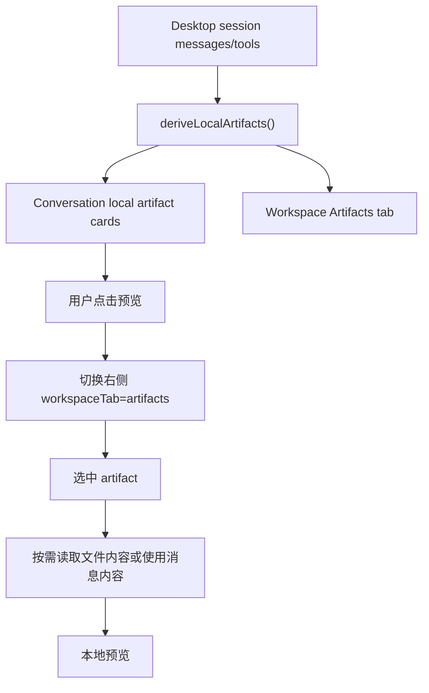

# SuperWork Local Artifacts 设计

## 目标

在 desktop 右侧工作区增加本地 Artifacts 预览与管理能力。该能力只服务图形界面体验，不改变 Claude Code 底层工具、模型调用、上下文协议，也不要求上传到云端。

Local Artifacts 的定位是：把当前对话里生成或写入到本地的可视化产物提取出来，提供列表、预览、打开、复制路径等操作。云端 `artifact` 工具仍保持原样，作为公开分享 URL 的能力，不和本地模式混用。

## 范围

第一版只做 MVP：

- 只改 `packages/desktop`。
- 从当前 desktop session 的消息和工具事件中派生 artifacts。
- 新增右侧工作区 `Artifacts` 标签。
- 聊天区出现可识别产物时显示轻量 Local Artifact 卡片。
- 支持本地预览 Markdown、HTML、Mermaid、PlantUML、SVG。
- 支持打开本地文件、复制路径、复制内容。

第一版不做：

- 不上传云。
- 不修改 `packages/builtin-tools/src/tools/ArtifactTool`。
- 不修改 Claude Code 核心 query loop。
- 不新增本地数据库。
- 不做跨会话资源库。
- 不自动把任意模型文本写入磁盘。

## Artifact 来源

### 1. Write 类工具写出的文件

当工具名包含 `write`，并且 `input.file_path` 或 `input.path` 指向以下扩展名时，desktop 将其识别为 Local Artifact：

- `.html`
- `.htm`
- `.md`
- `.markdown`
- `.svg`
- `.mmd`
- `.mermaid`
- `.puml`
- `.plantuml`

文件内容按需读取：进入 Artifacts 面板或选择某个 artifact 时再加载，避免把大文件塞进 session state。

### 2. 模型输出中的完整 fenced block

当 assistant 文本中出现完整代码块时，desktop 可派生一个“内存型 artifact”：

示例：

    ```html
    ...
    ```

支持语言：

- `html`
- `markdown` / `md`
- `mermaid`
- `plantuml`
- `svg`

内存型 artifact 不自动落盘。它只在当前 session UI 中预览，用户可以复制内容。后续如果要保存成文件，可以单独加“保存到文件”按钮。

### 3. 云端 artifact 工具结果

现有 `artifact` 工具返回的 URL 暂时不归入 Local Artifacts。它可以在工具卡里以“云端 Artifact”链接方式美化展示，但不进入本地预览列表。

## 数据模型

desktop 内部派生类型：

```ts
type DesktopLocalArtifact = {
  id: string
  source: 'file' | 'message'
  title: string
  kind: 'html' | 'markdown' | 'mermaid' | 'plantuml' | 'svg' | 'text'
  status: 'ready' | 'missing' | 'error'
  path?: string
  content?: string
  messageId?: string
  toolCallId?: string
  createdAt: number
  displayOrder?: number
  error?: string
}
```

实现上优先做纯 renderer 派生，不马上扩展 desktop protocol：

- `messages + tools -> localArtifacts`
- 不改变 `DesktopSessionSchema`
- 不新增 `artifact.updated` 事件

这样可以保持改动集中，降低对 core/协议层的影响。若后续要做跨会话持久化，再升级为协议字段。

## UI 设计

### 聊天区卡片

当消息或工具中识别到可预览产物时，在对应位置显示轻量卡片：

```text
┌ Local Artifact ────────────────────┐
│ dashboard.html       HTML · ready   │
│ 本地预览产物，不上传云              │
│ [预览] [打开文件] [复制路径]        │
└────────────────────────────────────┘
```

点击“预览”时：

1. 右侧工作区自动打开。
2. 切换到 `Artifacts` 标签。
3. 选中对应 artifact。

### 右侧 Artifacts 面板

沿用现有右侧工作区结构，与 `文件 / Agent` 同级：

```text
右侧工作区
├─ 文件
├─ Agent
└─ Artifacts
```

面板布局：

```text
┌ Artifacts ─────────────────────────┐
│ 左侧列表                            │
│ - dashboard.html        HTML        │
│ - report.md             Markdown    │
│ - architecture.mmd      Mermaid     │
│                                    │
│ 右侧预览                            │
│ [预览区域]                          │
│                                    │
│ 操作：打开 / 复制路径 / 复制内容     │
└────────────────────────────────────┘
```

空状态：

```text
还没有本地 Artifacts
生成 HTML、Markdown、Mermaid、PlantUML 或写入相关文件后会显示在这里。
```

### 预览规则

- Markdown：复用现有 `MarkdownMessage` 渲染。
- Mermaid / PlantUML：复用现有 `DiagramRenderer`。
- HTML：使用 sandboxed iframe，`sandbox=""`，只展示静态内容。
- SVG：作为文本或 iframe/srcDoc 展示，禁止执行脚本。
- 文件不存在：显示 missing 状态和原路径。
- 文件过大：第一版限制为 1MB，超过则显示“文件过大，点击打开本地文件查看”。

## 数据流



## 组件边界

建议新增：

- `packages/desktop/renderer/src/features/artifacts/localArtifacts.ts`
  - 负责解析消息、工具、文件扩展名，生成 `DesktopLocalArtifact`。
- `packages/desktop/renderer/src/features/artifacts/LocalArtifactsPanel.tsx`
  - 负责右侧列表、预览和操作按钮。
- `packages/desktop/renderer/src/features/artifacts/LocalArtifactCard.tsx`
  - 负责聊天区轻量卡片。

修改：

- `WorkspacePanel.tsx`
  - 增加 `Artifacts` tab。
- `ConversationPane.tsx`
  - 插入 Local Artifact 卡片，并支持 `onOpenArtifact`。
- `App.tsx`
  - 管理 `workspaceTab` 和选中的 artifact id。
- `preload` / command dispatcher
  - 若复用现有 `file.load` 不够，则增加只读文件加载命令；优先复用现有能力。

## 错误处理

- 文件不存在：卡片保留，但标记为“文件不存在”。
- 文件读取失败：显示错误摘要，不崩溃 UI。
- HTML/SVG 预览：禁止脚本执行。
- 未闭合 fenced block：不生成 artifact，避免流式输出中频繁抖动。
- 重复 artifact：以 `source + path/messageId + blockIndex` 生成稳定 id，避免重复列表项。

## 测试

新增或扩展 desktop 测试：

- `deriveLocalArtifacts` 能从 Write 工具识别 `.html/.md/.mmd/.puml/.svg`。
- `deriveLocalArtifacts` 忽略普通源码文件和云端 artifact URL。
- 完整 fenced block 生成内存 artifact，未闭合 fenced block 不生成。
- `WorkspacePanel` 渲染 Artifacts tab。
- 点击聊天区 artifact 卡片会打开右侧 Artifacts tab。
- HTML 预览使用 sandbox iframe。
- 文件缺失状态不会导致渲染异常。

## 后续扩展

MVP 稳定后再考虑：

- 保存内存型 artifact 到文件。
- 跨会话本地 artifact 索引。
- 图片、JSON、CSV 预览。
- 与云端 `artifact` 工具联动：本地预览满意后再上传。
- Artifact 版本历史。
